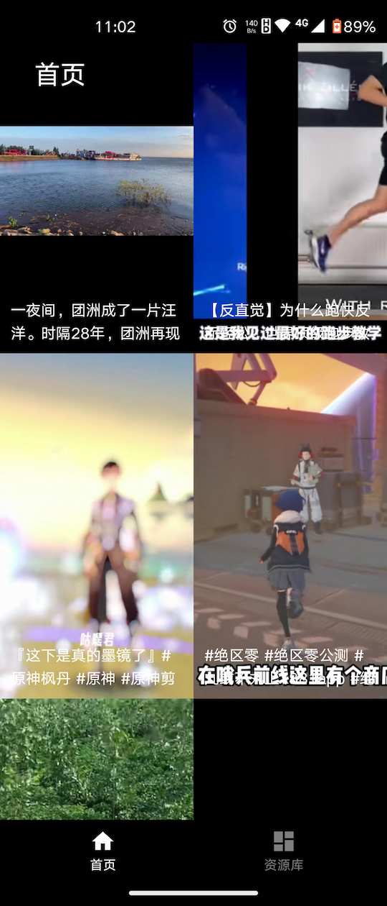
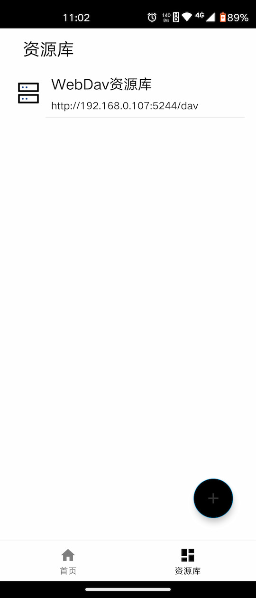
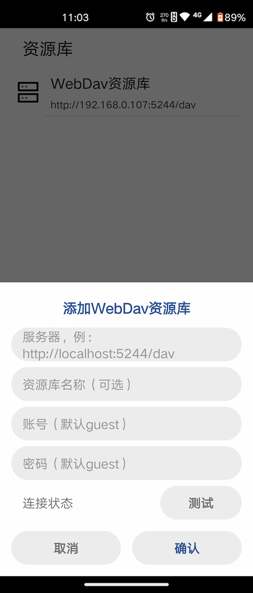
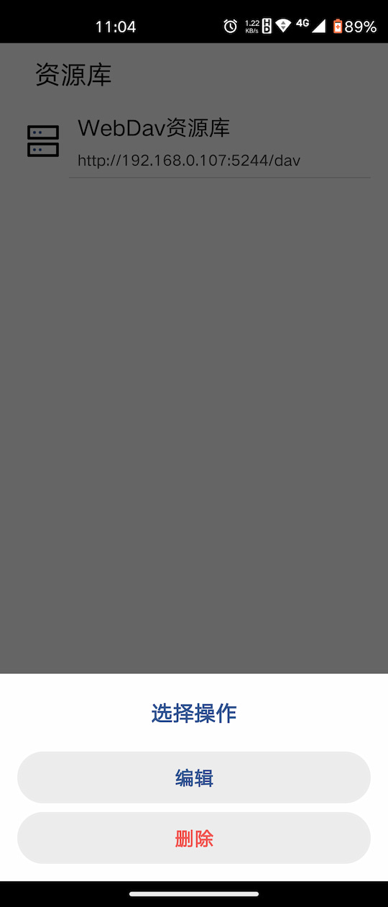
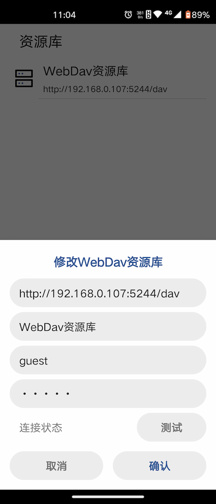
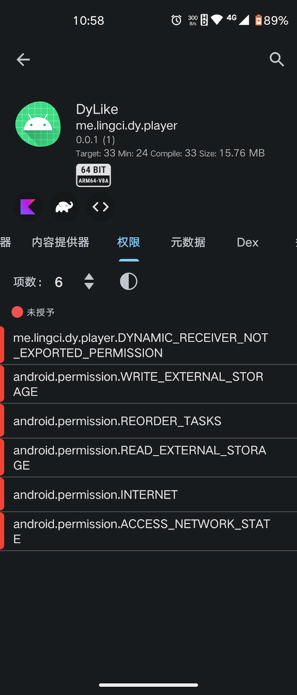
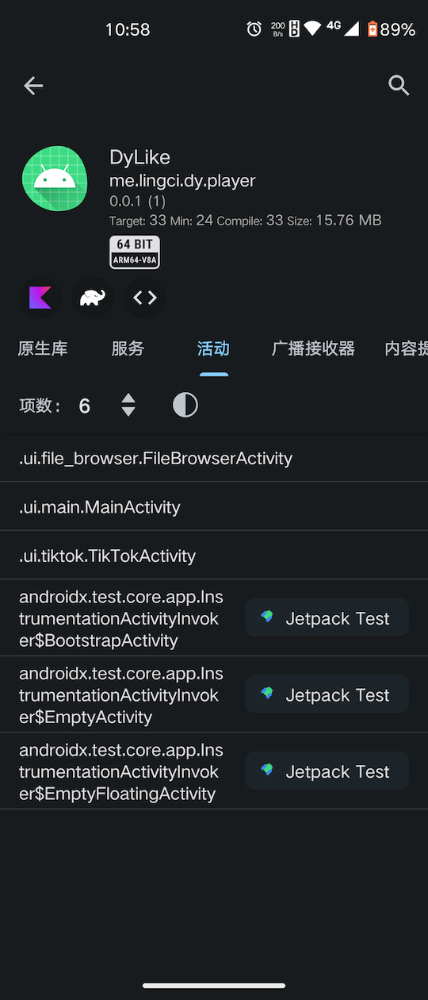

# DyLike

支持Webdav协议的类抖音播放器

## 说明

发得仓促，代码比较乱，而且问题较多，就没有上传代码，主要是基于别的项目开发的，来不及剥离
安装包也是一个预发布的包，如果不信任可以不安装
权限也只申请了存储，如果担心也可以拒绝权限，应该不影响，只和视频缓存有关
正常有网络就能用，没有网络局域网就能用

## 功能

首页，记录了历史，但是刷新机制没做，双击手动刷新
资源库，点击+号添加，单击进入浏览，长按支持编辑删除修改Webdav站点
没有其他了

## 截图

## 后记

有问题反馈，理解万岁
